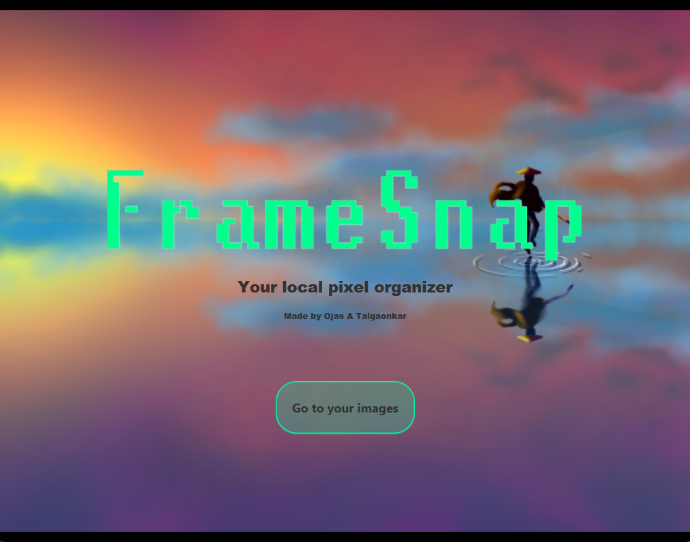

Welcome To

  

FrameSnap is a slightly retro themed image organizer/gallery app made in JavaFX and SceneBuilder.

On the Intro page, Click on "Go to your images" to access the gallery.

## Functions

<b>Selecting Categories</b>

Click on any of the categories to select them. Once selected, you can use any of the functions from the "Functions" tab on the selected category  

<b>Import Images</b>

This function allows you to add images to the selected category. Once you add images to the category the cover will be set to the latest image 
  
Clicking this will open a File explorer box where you can select an image 

For your convenience, I have added a folder ImagesToBeSorted in the main directory which contains some of my own nature photography and digital art that you can sort for testing

<b>Opening an Image category</b>

Use this function to open up the images in a viewing window. Now you can view any images you put in or remove any images. 

If there are no images in the category, it will be empty 

If there are images, then it will show up like this 
 
Use the arrows on the gallery to navigate between images

The gallery has two functions of its own in the "Functions" tab:

1)Go Back-> This function takes you back to the Categories display

2)Remove Image-> This function removes the current image from your category

3)Set Cover-> Sets the category cover to the current image.

Note: The cover usually changes automatically upon adding new images, but once a cover is set manually, the cover wont change automatically again.

<b>Rename Category</b>

This function allows you to rename the selected category to whatever you desire  
  
Doing this will open a text dialog box where you can enter the name 

<b>Close Window</b>

This function lets you close the home window  
Note: after a desicion to change the UI, this option is in the file menu instead of the functions menu  
  

<b>Saving and Reseting</b>

Click on the save button in the file menu to save all organizing. To delete all progress, just click reset memory. 

 
 
 

Future Improvements

1. Maybe adding a way to crop/resize and edit images in the gallery window.

2. Right now , saving is done by writing the urls to the images. This poses the problem of images dissapearing once the location is changed. So in the near future, maybe an internal memory will be developed where images themselves are stored

3. Adding a slideshow option and a way to share these images to certain platforms

4. Adding an inbuilt CLI to the app for more interesting navigation

5. Improving the UI/UX
